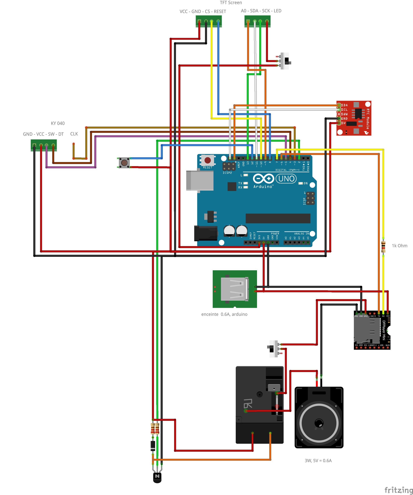

# An arduino alarm clock/music player/clock !
This project is a fully functionnal alarm clock and music player. With this device, you can play music when you want and also wake up with them. The music are store on a mini SD card and played randomly, so no worrying about hearing the same music or ring each morning !!

No need to worry about the time if the device is disconected, a small battery inside the clock (RTC) keep the time ticking. You just need to replug the device and everything is working !

# Project Architecture
- 📁 3d
    - Some 3D model that I have not printed yet
- 📁 code
    - 📁 main
        - Contains the main script
    - 📁 tests
        - Contains tests script for each individual element of the project (RTC, TFT, music player). A good way to debug your circuit if something is not working  
- 📄 Wiring.fzz
    - A Fritzing schematic of the project

# Components
- 1 Arduino UNO
- 1 TFT Screen (1.8) 
- 1 RTC module (DS3231)
- 1 Rotary encoder (KY040)
- 1 Music module (DFPlayer Mini)
- 1 USB module
- 1 Speaker (8 Ohms, 3W)
- 3 1K Omhs Resistor
- Optional (If noise in speaker when no music is played) :
    - 1 Relay (SRD-05VDC-SL-C)
    - 1 Transistor (2N2222)
    - 1 Diode
    - 2 Switch (TFT and Speaker)

# Libraries
- RTClib
- Wire
- TFT
- SPI
- SoftwareSerial
- DFRobotDFPlayerMini


# Project Utilisation
There is 3 main screens. Press the simple button to switch between these !
- ## Main Screen : Hour Display
    - Display the hour
    - The double dots slightly blink each second
    - Press the Rotary encoder button to activate/deactivate the alarm
- ## Alarm Screen
    - Display the alarm hour
    - Press the rotary encoder button to configure the alarm : 
        - Rotate the rotary encoder to change the digit
        - Press the rotary encoder to switch to another digit
- ## Music Screen
    - Display the volume
    - Press the rotary encoder button to activate the music :
        - A random music will start
        - Change music by pressing the button
        - Stop the music by pressing the rotary encoder button


# Some useful facts
- The music is randomly choose
- The alarm is active only if you are in the main screen !!! Be sure to switch back to the main screen each time you use the project
- The 2 switch are there to manually turn off the speaker or the TFT screen (useful if you want to sleep in silence and without light)
- When uploading the main code to arduino, be sure to uncomment the line ~148 :
  ```arduino
  rtc.adjust(DateTime(F(__DATE__),F(__TIME__)));
  ```
  in order to initialize the RTC with the time of the code compilation. Then upload again the code but with the same line commented in order to not reset the time to the compilation time every time the arduino restart.

# Wiring

